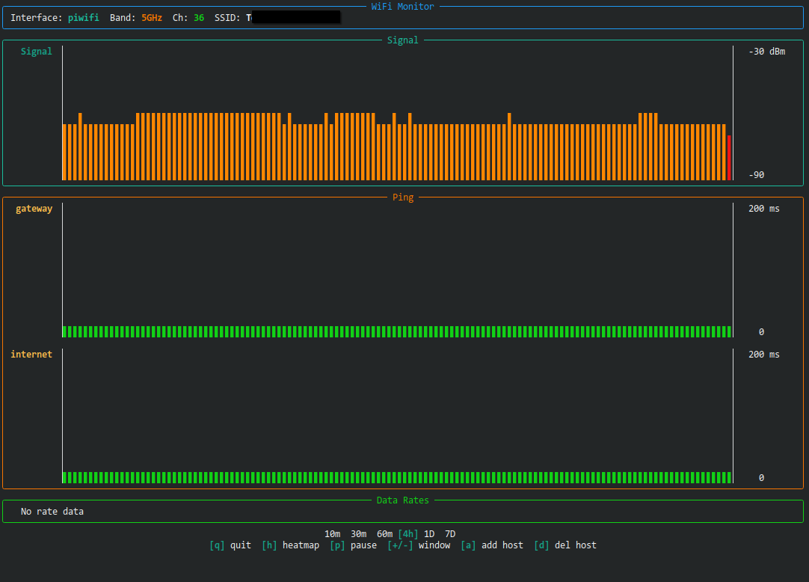

# WiFi Monitor CLI

A terminal-based WiFi link and latency monitor for Linux. Real-time visualization of WiFi signal strength, ping latency, and channel congestion - all in your terminal.



## Features

- **Live Monitoring**
  - WiFi signal strength (dBm) with sparkline history
  - Multi-host ping latency tracking
  - RX/TX data rates with progress bars
  - Channel bandwidth

- **Channel Heatmap**
  - Historical channel congestion visualization
  - Last 7 days of scan history
  - 2.4GHz and 5GHz band support (auto-detected)
  - Automatic hourly background scanning

## Installation

### From source

```bash
# Clone the repository
git clone https://github.com/vdpopov/Wireless-Link-Quality-Dashboard-CLI.git
cd Wireless-Link-Quality-Dashboard-CLI

# Create virtual environment (recommended)
python -m venv venv
source venv/bin/activate

# Install
pip install -e .
```

### Dependencies

**System requirements:**
- `iw` - WiFi interface info
- `ip` (iproute2) - Network routing info
- `ping` (iputils) - Latency measurement
- `nmcli` (NetworkManager) - WiFi scan cache refresh (optional)

On Arch Linux:
```bash
sudo pacman -S iw iproute2 iputils networkmanager
```

On Debian/Ubuntu:
```bash
sudo apt install iw iproute2 iputils-ping network-manager
```

**Python requirements:**
- Python 3.9+
- rich >= 13.0
- numpy >= 1.20

## Usage

```bash
# Run with auto-detected interface
wifi-monitor-cli

# Specify interface
wifi-monitor-cli -i wlan0
```

### Controls

**Live View:**
| Key | Action |
|-----|--------|
| `q` | Quit |
| `h` | Switch to heatmap view |
| `p` | Pause/resume data collection |
| `+`/`-` | Zoom in/out time window |
| `a` | Add ping host |
| `d` | Delete ping host |

**Heatmap View:**
| Key | Action |
|-----|--------|
| `q` | Quit |
| `l` | Switch to live view |

## Data Storage

Scan data is stored in `~/.config/wifi-monitor/scans/` as JSON files (one per day). Channel scans run automatically every hour in the background. This data is shared with the GUI version of wifi-monitor if installed.

## License

MIT
